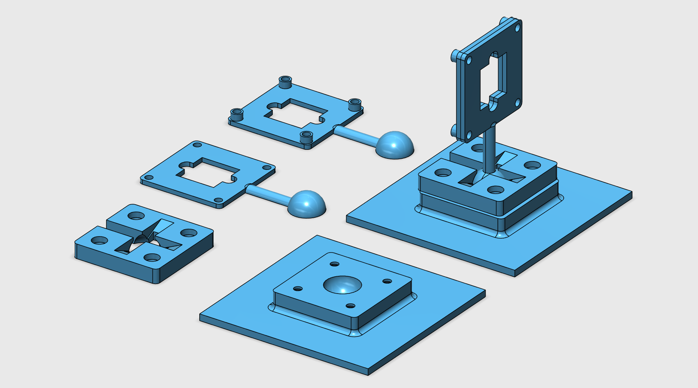
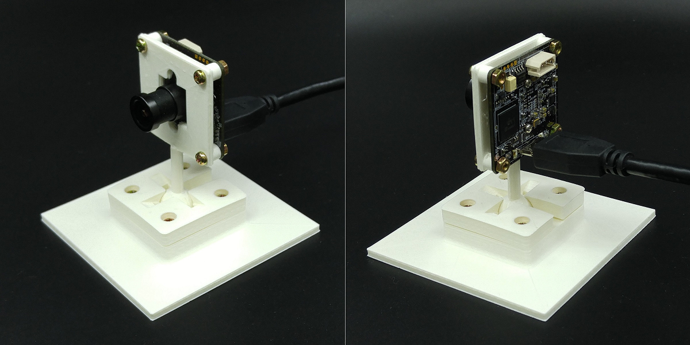
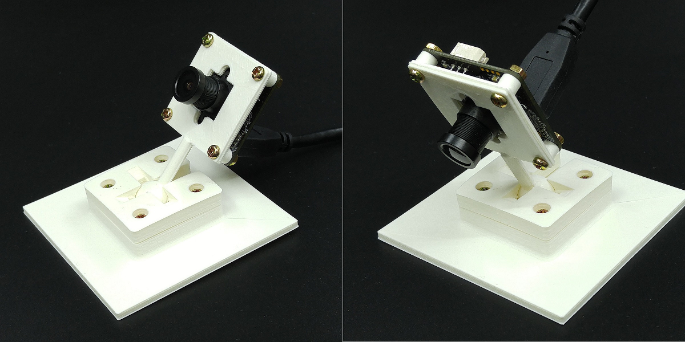
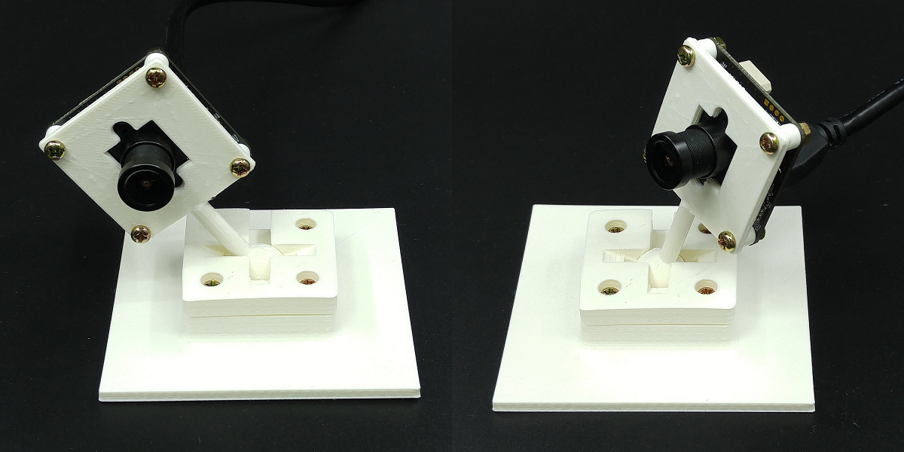

# DIY Fixture

## Fixture 1707_1

## BOM
* Base Panel 1: oCam_Fixture_1707_1_Base1.stl
* Base Panel 2: oCam_Fixture_1707_1_Base2.stl
* Front Panel 1 : oCam_Fixture_1707_1_Front1.stl
* Front Panel 2 : oCam_Fixture_1707_1_Front2.stl
* M3 x 10 screw: 8
* M3 nut: 8

## 3D Printouts

## 3D Viewer
* https://skfb.ly/6s6PG

## 3D CAD (Autodesk 123D Design Format)
* [oCam_Fixture_1707_1.123dx](oCam_Fixture_1707_1.123dx)
