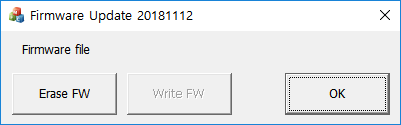
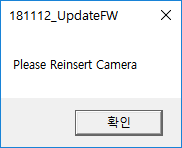
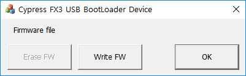
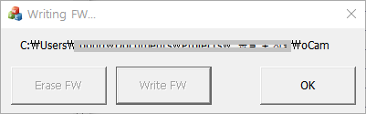
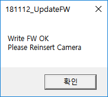

# How to update the firmware of oCam Cameras
### Step 1. Check the current status (this step is optional)
* Open ***Device Manager***. If the oCam camera has a firmware and is working normally as a UVC camera, it should appear as a camera (on Windows 10) or an imaging device (on Windows 7). Go to step 3 to erase the current firmware.
* If the oCam camera appears as "Cypress FX3 USB BootLoader Device" under USB category on ***Device Manager***, the oCam firmware was already erased and the host has a USB driver to download a firmware. Go to step 4 to download a firmware.
* If the oCam camera appears as "WestBridge" device on ***Device Manager***, oCam camera does not have a firmware and the host does not have a USB driver. Go to step 2 to install a USB driver.

### Step 2. Install the USB driver (this step is optional)
* Download the USB driver from [here](https://github.com/withrobot/oCam/blob/master/Firmware/Update_FW/Drivers%20for%20FX3.zip)
* Open ***Device Manager***.
* Right click on "WestBridge" device and update the driver using the downloaded driver according to the type of host system.

### Step 3. Erase the current firmware
* Download the update program from [here](https://github.com/withrobot/oCam/blob/master/Firmware/Update_FW/181112_UpdateFW.zip) 
* Run ***UpdateFW.exe***

* Click ***[Erase FW]***
* On successful erasure, a message window will popup as shown next.

* Disconnect and connect the oCam camera
* You can check if the firmware was successfully erased by checking if oCam appears as "Cypress FX3 USB BootLoader Device" on ***Device Manager***.

### Step 4. Install the firmware
* Run again the ***UpdateFW.exe***.

* Click ***[Write FW]*** to select the firmware image file (* .img). On selecting a new firmware, UpdateFW will write the new firmware to oCam

* On successful writing, a message window will pop up as shown next.

* Disconnect and reconnect the USB cable to complete the firmware update procedure.

### Step 5. Check if the firmware successfully downloaded to oCam (this step is optional)
* Open ***Device Manager***.
* If the firmware was successfully downloaded, it should appear as a camera (on Windows 10) or an imaging device (on Windows 7).
* If the oCam camera model appears as different from what is actually connected, right click and remove oCam device on ***Device Manager***, then disconnect and connect the oCam camera again. Correct model name should appear on ***Device Manager***.

