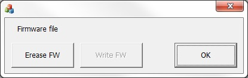
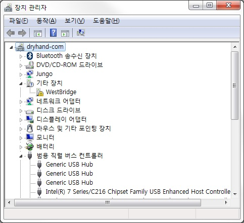

# How to update the firmware of oCam Cameras
### Step 1. Check the current status (this step is optional)
Open Device Manager.
If the oCam camera has a firmware and is working normally as a UVC camera, it should appear as a camera (on Windows 10) or an imaging device (on Windows 7).
Go to step 3 to erase the current firmware.

### Step 2. Click *[Erase FW]* to erase the installed firmware of oCam.
### Step 3. Check *[Device Manager]* to see if oCam appears as a WestBridge device with unknown device driver as shown below.

### Step 4. Install the device driver of the WestBridge device using the driver in the *[Drivers for FX3.zip]* directory.
### Step 5. Check *[Device Manager]* to see if oCam appears as a Cypress USB BootLoader device as shown below.

### Step 6. Run again the *[UpdateFW.exe]*.

### Step 7. Click *[Write FW]* to select the firmware image file (*.img). After selecting a new firmware, UpdateFW will write the new firmware to oCam. On successful writing, a message window will pop up as shown below.

### Step 8. Disconnect and reconnect the USB cable to complete the firmware update procedure.
