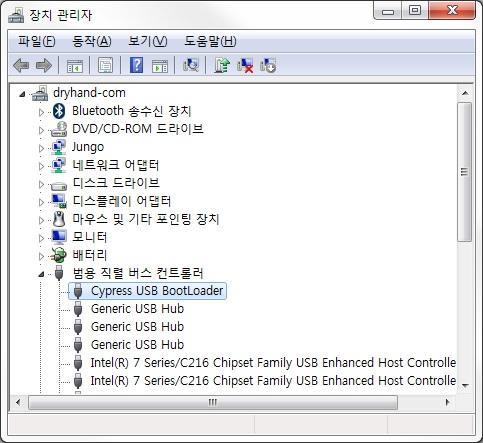
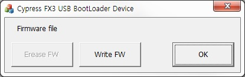
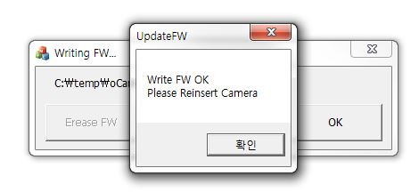

# How to update the firmware of oCam Cameras
### Step 1. Check the current status (this step is optional)
* Open Device Manager.
* If the oCam camera has a firmware and is working normally as a UVC camera, it should appear as a camera (on Windows 10) or an imaging device (on Windows 7).
* Go to step 3 to erase the current firmware.

### Step 2. Install the USB driver (this step is optional)
* Download the USB driver from [here](https://github.com/withrobot/oCam/blob/master/Firmware/Update_FW/Drivers%20for%20FX3.zip)
* Open Device Manager.
* Right click on "WestBridge" device and update the driver using the downloaded driver according to the type of host system.

### Step 3. Erase the current firmware
* Download the update program from [here]() 
  * Run UpdateFW.exe

 * Click [Erase FW]
 * On successful erasure, a message window will popup as shown next.

* Disconnect and connect the oCam camera
 * You can check if the firmware was successfully erased by checking if oCam appears as "Cypress FX3 USB BootLoader Device" on Device Manager.

### Step 4. Install the device driver of the WestBridge device using the driver in the *[Drivers for FX3.zip]* directory.
### Step 5. Check *[Device Manager]* to see if oCam appears as a Cypress USB BootLoader device as shown below.

### Step 6. Run again the *[UpdateFW.exe]*.

### Step 7. Click *[Write FW]* to select the firmware image file (*.img). After selecting a new firmware, UpdateFW will write the new firmware to oCam. On successful writing, a message window will pop up as shown below.

### Step 8. Disconnect and reconnect the USB cable to complete the firmware update procedure.
