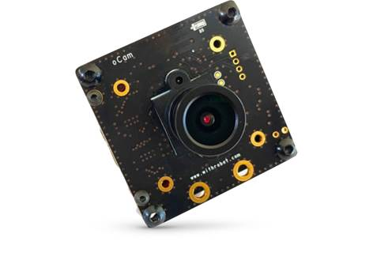
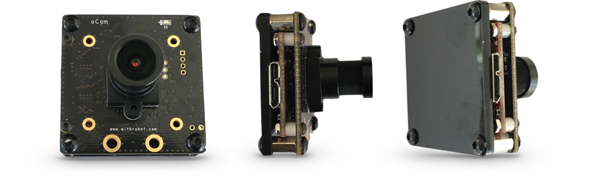

# oCam - 5MP USB 3.0 Color Board Camera
### Model No. oCam-5CR-U3

* **Easy**: oCam does note require any device driver to be installed on the host PC or the Odroid-XU4
* **Versatile**: oCam supports the M12 lens format of various focal lengths for different needs
* **Low CPU usage**: oCam supports USB 3.0 with direct memory access, allowing data to be written to main memory without going through the CPU
* **Good for embedded system**: oCam is verified with the Odroid-XU4 embedded board from HardKernel™

## Board Detail

## Specifications
Type | Description |
------|------|
**Sensor** | OmniVision OV5640 CMOS Image sensor |
**Interface** | USB 3.0 |
**Lens** | Standard M12 Lens with focal length of 3.6mm (optional – 4mm, 8mm, 12mm) | 
**Supported OS** | Windows7, Windows8, Windows10, Linux, Plug-and play by UVC(USB Video Class) compliant | 
**Power** | USB Bus Power | 
**Operation Temperature** | 0°C ~ + 70°C |
**Rating** | DC 5V/290mA |
**Shutter** | Electric Rolling Shutter |
**Field Of View(FOV)** | 65deg. |
**Camera Control** | Brightness, Contrast, Hue, Saturation, White Balance | 
**Frame Rate** | **YUV** 1920x1080@15fps, 1280x720@30fps, 640x480@30fps  **MJPEG** 1920x1080@30fps, 1280x720@45fps, 640x480@30fps | 
**Weight** | 30.5g | 
**Size** | 42mm x 42mm | 

