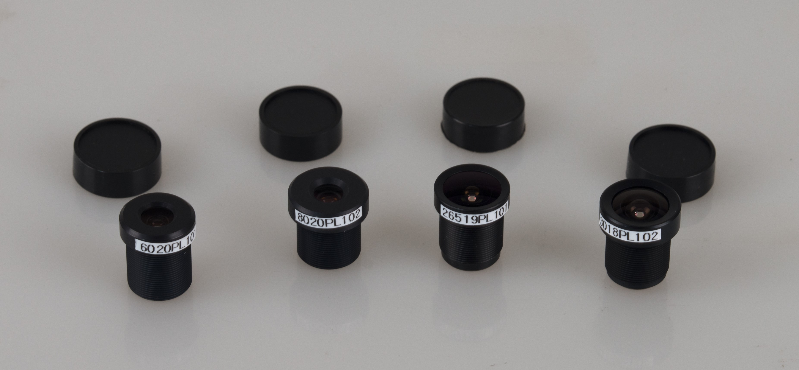

#oCam Lens set - M12 Lens4 set
###Model No. Lens4-8-6-3-2.6 - [sales website](http://www.hardkernel.com/main/products/prdt_info.php?g_code=G147305973926)

The M12 Lens4 is a set of four M12 lenses which is an ideal choice to be used with oCam series cameras with the following features.

* Compatible with oCam series cameras
* Various focal lengths for different applications
* Standard M12 mount

###Nomenclature

Lens Set: Len4-A-B-C-D
* A, B, C and D are codes to represent the focal length of each lens
* Variations of focal length codes; 
 * dd

##Key Specifications

Type | Description |
------|------|
**Focal Length** | * 8020PL002: 8 mm  * 6020PL001: 6 mm  * 3018PL002: 3 mm  * 26519PL002: 2.65 mm  |
**Iris** | Fixed |
**Image Sensor Size** | * 8020PL002: 1/2.9 inch  * 6020PL001: 1/3 inch  * 3018PL002: 1/2.9 inch  * 26519PL002: 1/3 inch  |
**Mount(Thread)** | M12 x P0.5 | 
**Angle of View** | * 8020PL002: 21° x 39° x 45° @ 1/2.9inch  * 6020PL001: 35° x 49° x 60° @ 1/3inch  * 3018PL002: 65° x 111° x 126° @ 1/2.9inch  * 26519PL002: 74°x 110° x 150° @ 1/3inch  | 
**Housing** | Metal | 
**Optics** | Glass with IR cut filter (650nm) or Glass without IR cut filter |
**Package** | Box of 4 lenses contained in soft sponge |

##External Looks

