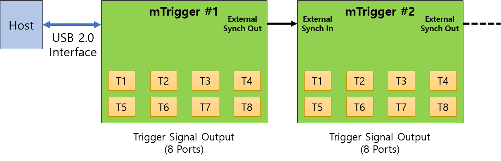

# mTrigger - 트리거 신호 생성 보드
### Model No. mTrigger - sales website

mTrigger는 트리거 신호를 발생하는 보드로 특히 외부 트리거 (External Trigger)를 지원하는 위드로봇㈜의 oCam-1CGN-U-T 및 oCam-1MGN-U-T카메라들에 적합한 트리거 신호를 제공하는데 사용할 수 있습니다. 

### 트리거 신호 출력 모드

기준 신호 | 출력 신호 동기 / 비동기 | 모드 명칭 | 내용 |
------|------|------|------|
**내부** | 동기 | 내부 동기 트리거 모드 (Internal Synchronous) | 자체적으로 8개의 트리거 신호를 동시에 발생 |
|| 비동기 | 내부 비동기 트리거 모드 (Internal Asynchronous) | 자체적으로 8개의 트리거 신호를 순차적으로 발생 |
**외부** | 동기 | 외부 비동기 트리거 모드 (External Synchronous) | 외부 신호를 기준으로 8개의 트리거 신호를 동시에 발생 |
|| 비동기 | 외부 비동기 트리거 모드 (External Asynchronous) | 외부 신호를 기준으로 8개의 트리거 신호를  발생 |

### Cascade 연결 구성

다수 mTrigger 보드들을 Cascade 방식으로 연결할 수 있으며, 연결 구성은 아래와 같습니다.

## Board Detail

## 주요 사양
항목 | 사양 |
------|------|
**출력 포트의 수** | 보드 당 8개 |
**출력 레벨** | Low Level: 0V / High Level: 5V |
**외부 입력 레벨** | Low Level: 0V / High Level: 5V |
**동기 트리거 모드에서 출력 신호들 사이의 동기 정확도** | 3 μsec 이내 | 
**동기 트리거 출력 신호들의 간격(F)** | 5 msec ~ 30,000 msec | 
**비동기 트리거 출력 신호들의 간격(T)** | 0 msec ~ 30,000 msec | 
**트리거 출력 신호의 폭(W)** | 5 msec ~ 30,000 msec |
**트리거 출력 신호의 수(N)** | 0 ~ 30,000 |

