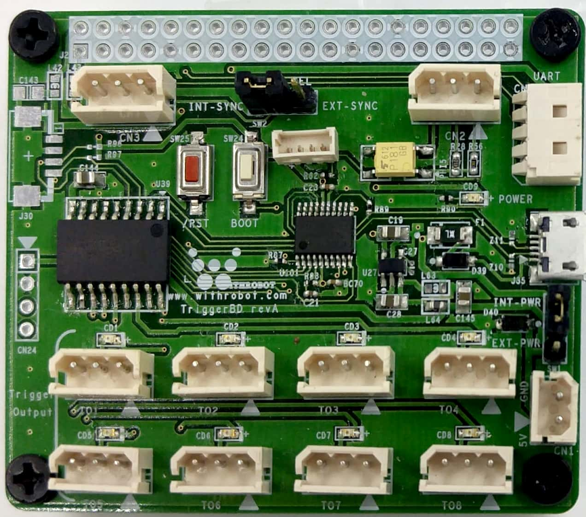
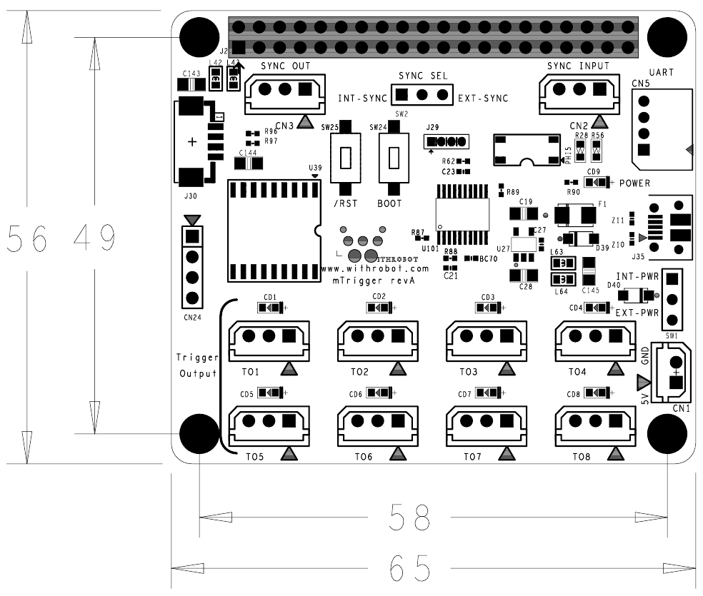
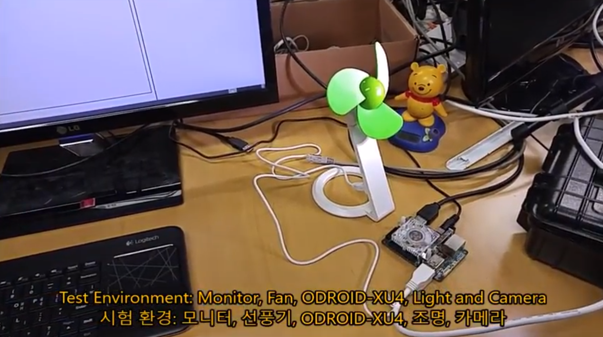

# mTrigger - 트리거 신호 생성 보드
### Model No. mTrigger - sales website

{: width="100" height="100"}

mTrigger는 트리거 신호를 발생하는 보드로 특히 외부 트리거 (External Trigger)를 지원하는 위드로봇㈜의 oCam-1CGN-U-T 및 oCam-1MGN-U-T카메라들에 적합한 트리거 신호를 제공하는데 사용할 수 있습니다. 
트리거 신호는 총 4가지 모드로 출력할 수 있습니다.

## Board Detail

## 주요 사양
항목 | 사양 |
------|------|
**출력 포트의 수** | 보드 당 8개 |
**출력 레벨** | Low Level: 0V / High Level: 5V |
**외부 입력 레벨** | Low Level: 0V / High Level: 5V |
**동기 트리거 모드에서 출력 신호들 사이의 동기 정확도** | 3 μsec 이내 | 
**동기 트리거 출력 신호들의 간격(F)** | 5 msec ~ 30,000 msec | 
**비동기 트리거 출력 신호들의 간격(T)** | 0 msec ~ 30,000 msec | 
**트리거 출력 신호의 폭(W)** | 5 msec ~ 30,000 msec |
**트리거 출력 신호의 수(N)** | 0 ~ 30,000 |

## Global Shutter vs. Rolling Shutter

## Softwares
* [oCam-1CGN-U_R1808_180815.img](../../Firmware)
* [oCam_viewer_Linux](../../Software/oCam_viewer_Linux)
* [oCam_viewer_Windows](../../Software/oCam-viewer_Win)
