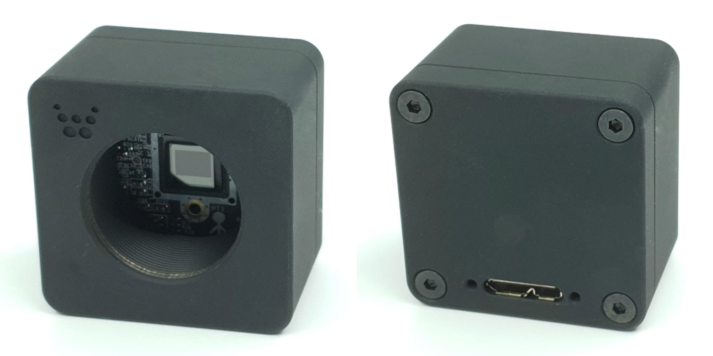
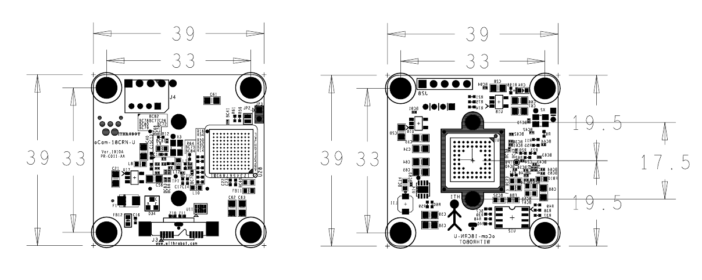

# oCam - 18MP USB 3.0 C-MOUNT Color Camera
### Model No. oCam-18CRN-U - sales website

The newly released oCam-18CGN-U is a C-MOUNT color camera with the following key features.

* High resolution: 4896 x 3620(USB 3.0)
* High speed: Up to 240 frames-per-second at the 640 x 480 resolution
* Handy: Protective case(Include tripod mount and USB cable locking pins)
* UVC compliant
* Changeable standard C-MOUNT lens

## Board Detail

## Specifications
Type | Description |
------|------|
**Sensor** | OnSemi AR1820HS CMOS image sensor |
**Sensor Size** | 1/2.3 inch |
**Interface** | USB 3.0 Super-Speed |
**Lens** | Standard C-MOUNT Lens (NOT included) | 
**Supported OS** | Windows 10 / Linux / Plug-and play by UVC(USB Video Class) protocol | 
**Power** | USB Bus Power | 
**Operation Temperature** | 0°C ~ + 70°C |
**Rating** | DC 5V/190mA |
**Shutter** | Electric Rolling Shutter |
**Camera Control** | Gain, White Balance Blue, White Balance Red, Exposure | 
**Frame Rate** | 4896 × 3672 @10fps, 4320 × 3240 @10fps, 3840 × 2160 @20fps, 2048 × 1152 @60fps, 1920 × 1440 @60fps, 1920 × 1080 @60fps, 1280 × 1024 @120fps, 1280 × 720 @120fps, 1024 × 768 @120fps, 640 × 480 @240fps  | 
**Weight** | 87 gram approx.(Including protective case) | 
**PCB Size** | 39mm x 39mm | 
**Case Size** | 42mm x 42mm x 27mm |

## Softwares
* [oCam-18CRN-U_R1908.img](../../Firmware) - TBD
* [oCam_viewer_Linux](../../Software/oCam_viewer_Linux)
* [oCam_viewer_Windows](../../Software/oCam-viewer_Win)
