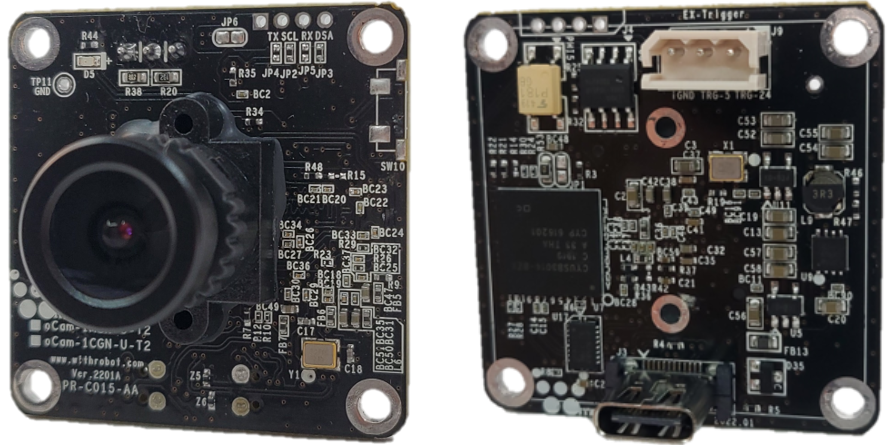
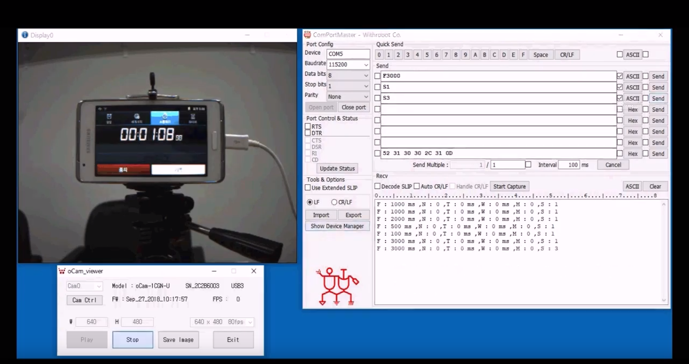
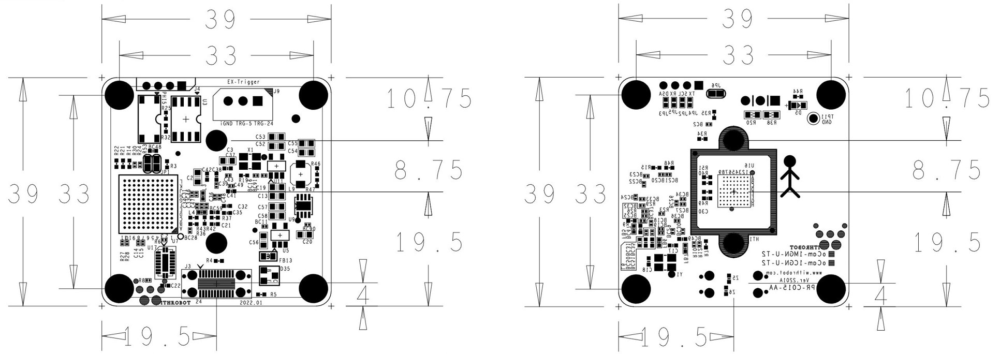
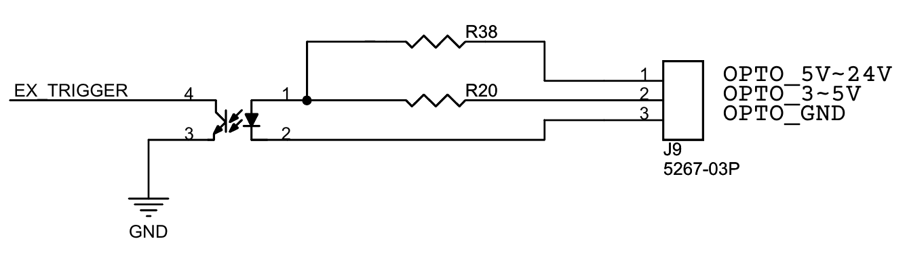
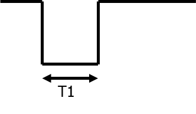
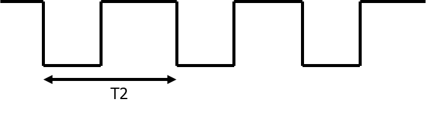

# oCam - 1MP USB 3.0 Color Trigger Global Shutter Camera
### Model No. oCam-1CGN-U-T2 - [Homepage](http://withrobot.com/camera/ocam-1cgn-u-t2/)
 
 
</img>

oCam-1CGN-U-T2는 외부 트리거(External Trigger)를 지원하는 1 메가 픽셀급의 글로벌 셔터 칼라 카메라로 다음과 같은 특징을 갖고 있습니다.
* 외부 트리거(External Trigger) 지원: 영상 취득의 Timing을 임의로 조절할 수 있어 다수의 카메라의 동기 촬영과 외부 조명과 동기화 가능
* 인터페이스: USB3.0 SuperSpeed, 최대 180 FPS(320 × 240 해상도 기준)
* UVC 1.1 표준 지원으로 리눅스 및 윈도우 OS에서 별도의 드라이버 설치가 불필요
* 교체형 M12 표준 렌즈를 지원하여 다양한 기존 상용 렌즈를 활용 가능
* 글로벌 셔터 방식으로 Image Skew가 없는 선명한 영상 취득 가능
 

## Board Detail

## Specifications
Type | Description |
------|------|
**Sensor** | OnSemi AR0135 CMOS Color image sensor |
**Sensor Size** | 1/3 inch |
**Output Format** | BayerRGB |
**Interface** | USB 3.0 Super-Speed |
**Lens** | 표준 M12 교환형(Focal length 3.6mm) | 
**Supported OS** | Windows7 / 10, Linux, Plug-and play by UVC(USB Video Class) protocol | 
**Power** | USB Bus Power | 
**Operation Temperature** | 0°C ~ + 70°C |
**Rating** | DC 5V / 180mA |
**Shutter** | Electric Global Shutter |
**Field Of View(FOV)** | 50˚(V) x 92.8˚(H) x 110˚(D) (기본 렌즈 기준) |
**Camera Control** | * Manual Exposure Control  * Gain Control  * Maunual White Balance Red Control  * Maunual White Balance Red Control  * Auto White Balance Setup (by oCamViewer* Software) |
**Frame Rate** | 1280x960 @54fps, 1280x720 @60fps, 640x480 @100fps, 320x240 @180fps | 
**Weight** | 약 27.2 그램(케이스 포함) | 
**PCB Size** | 39mm x 39mm | 
**외형 크기** | 49mm x 49mm x 20mm |
* *oCamViewer: 별도로 위드로봇㈜에서 제공하는 Windows용 카메라 영상 뷰어 프로그램

## 트리거 신호
### 트리거 신호 포트
외부 트리거 신호는 카메라 후면에 노출된 3핀 커넥터에 연결하여 인가할 수 있습니다.  커넥터의 각 핀은 아래와 같습니다. 
•	트리거 신호 (5V ~ 24V): 트리거 신호가 5V에서 24V 레벨일 때 이 핀으로 입력합니다. 
•	트리거 신호 (3V ~ 5V): 트리거 신호가 3V에서 5V 레벨일 때 이 핀으로 입력합니다. 
•	GND: 트리거 신호의 접지선을 이 핀으로 입력합니다. 
카메라의 트리거 신호 입력 회로는 아래와 같습니다. 
트리거 입력 핀과 oCam-1CGN-U-T의 회로는 Photo Coupler를 통하여 격리되어 있으므로 트리거 신호 핀에 2mA 이상의 전류를 공급해야 트리거 신호가 안정적으로 카메라에 전달될 수 있습니다.

#### 트리거 신호 입력 회로

### 트리거 모드별 신호 형태
트리거 신호는 기본적으로 하강 에지(Falling Edge)를 기준으로 영상이 취득됩니다. 
트리거 신호는 인가되는 형태에 따라 다음과 같은 3가지의 모드로 사용할 수 있습니다.

#### 원 샷 모드(One Shot Mode)
1회의 영상을 취득할 경우에 사용됩니다. 트리거 신호의 Low Level 지속 시간(T1)은 1 msec 이상이어야 합니다. 
 

#### 멀티 샷 모드(Multi Shot Mode)
다수의 영상을 취득할 경우에 사용됩니다. 
영상이 취득되는 트리거 신호의 하강 에지 사이의 간격(T2)은 2 msec 이상이어야 합니다. 
멀티 샷 모드에서 카메라의 전송 속도는 트리거 신호의 약 2배가 되도록 설정하는 것이 바람직합니다. 
예를 들어, 30Hz로 트리거 신호를 인가하려는 경우, 카메라 설정은 60 fps 이상으로 하는 것이 바람직합니다. 
이보다 낮을 경우 카메라에서 취득된 영상이 외부로 전송되는 도중에 다음 트리거 신호가 인가되어 트리거 신호를 카메라가 정상적으로 감지하지 못하는 경우가 발생할 수 있습니다. 
즉, 다음 트리거 신호가 인가되기 전에 이전에 취득된 이미지가 충분히 전송될 수 있을 정도로 카메라의 전송 속도를 충분히 높게 하는 것이 필요합니다. 
 

#### 연속 모드(Continuous Mode)
영상을 연속적으로 취득할 경우에 사용됩니다. 
트리거 신호의 하강 에지 이후에는 설정된 전송 속도에 따라 자동적으로 영상이 취득되어 전송됩니다. 
예를 들어 아래 그림에서 이미지 전송 간격 T3는 설정된 카메라의 fps에 의해 결정됩니다. 
트리거 신호가 High Level로 되면 영상 취득이 중단됩니다. 
 

## Softwares
* TBD
* [oCam_viewer_Windows](../../Software/oCam-viewer_Win)
* [oCam_viewer_Linux](../../Software/oCam_viewer_Linux)
