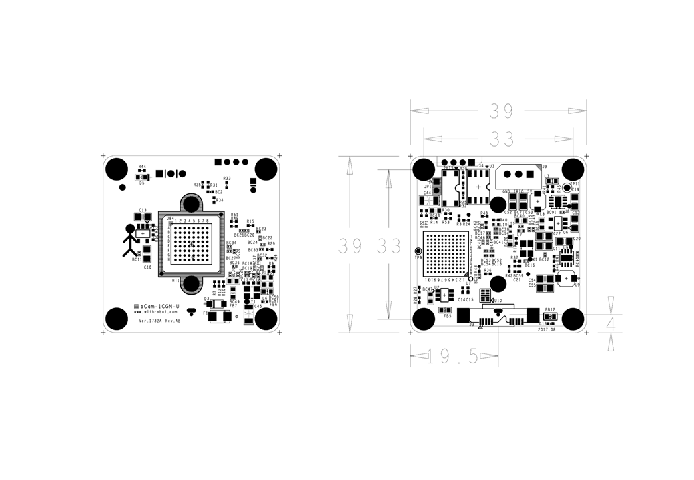

# oCam - 1MP USB 3.0 Color Global Shutter Camera
### Model No. oCam-1CGN-U - sales website

The newly released oCam-1CGN-U is a global shutter color camera with the following key features.
* Color output of Bayer GRBG format
* Global shutter
* High speed up to 160 frames-per-second at the 320 x 240 resolution
* UVC compliant
* Changeable standard M12 lens

## Board Detail

## Specifications
Type | Description |
------|------|
**Sensor** | OnSemi AR0135 CMOS image sensor |
**Sensor Size** | 1/3 inch |
**Interface** | USB 3.0 Super-Speed |
**Lens** | Standard M12 Lens (Changeable) | 
**Supported OS** | Linux / Windows 7, 10 / Plug-and play by UVC(USB Video Class) protocol | 
**Power** | USB Bus Power | 
**Operation Temperature** | 0°C ~ + 70°C |
**Rating** | DC 5V/180mA |
**Shutter** | Electric Global Shutter |
**Field Of View(FOV)** | - 65 degrees at full resolution of 1280(H) x 960(V)  - FOV for the following resolutions are reduced from the full resolution image due to cropping: 1280(H) x 720(V), 320(H) x 240(V)  - FOV for the following resolutions is maintained due to binning: 640(H) x 480(V) |
**Camera Control** | Gain, White Balance Blue, White Balance Red, Exposure | 
**Frame Rate** | **USB 3.0**: 1280x960 @54fps, 1280x720 @60fps, 640x480 @100fps, 320x240 @180fps | 
**Weight** | 27.2 gram approx.(Including protective case and Lens) | 
**PCB Size** | 39mm x 39mm | 
**Case Size** | 49mm x 49mm x 20mm |
**Depth** | 30-35 mm (Variable length for Manual Focusing) |

## Global Shutter vs. Rolling Shutter

## Softwares
* [oCam-1CGN-U_R1808_180815.img](../../Firmware)
* [oCam_viewer_Linux](../../Software/oCam_viewer_Linux)
* [oCam_viewer_Windows](../../Software/oCam-viewer_Win)
