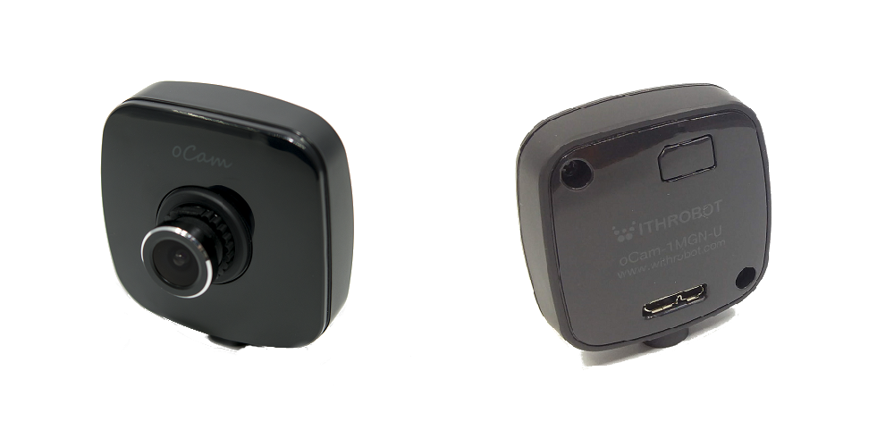
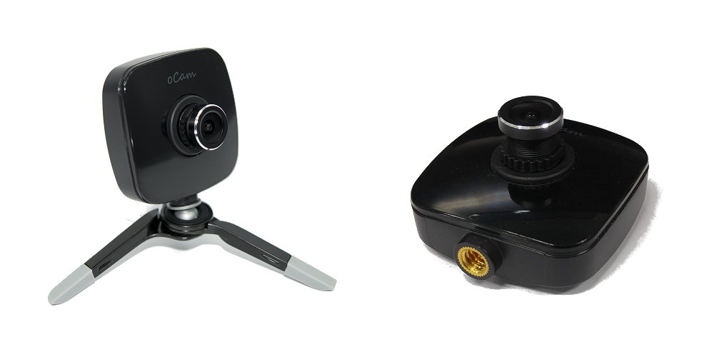
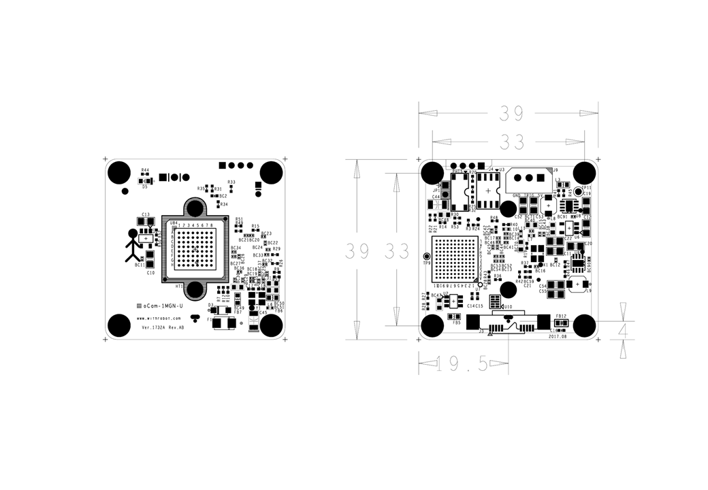

# oCam - 1MP USB 3.0 Mono Global Shutter Camera
### Model No. oCam-1MGN-U-T - sales website

oCam-1CGN-U-T는 외부 트리거(External Trigger)를 지원하는 1 메가 픽셀급의 글로벌 셔터 칼라 카메라로 다음과 같은 특징을 갖고 있습니다.
* 외부 트리거(External Trigger) 지원: 영상 취득의 Timing을 임의로 조절할 수 있어 다수의 카메라의 동기 촬영과 외부 조명과 동기화 가능
* 인터페이스: USB3.0 SuperSpeed, 최대 160 FPS(320 × 240 해상도 기준)
* UVC 1.1 표준 지원으로 리눅스 및 윈도우 OS에서 별도의 드라이버 설치가 불필요
* 교체형 M12 표준 렌즈를 지원하여 다양한 기존 상용 렌즈를 활용 가능
* 글로벌 셔터 방식으로 Image Skew가 없는 선명한 영상 취득 가능
 

## Board Detail

## Specifications
Type | Description |
------|------|
**Sensor** | OnSemi AR0135 CMOS image sensor |
**Sensor Size** | 1/3 inch |
**Output Format** | BayerRGB |
**Interface** | USB 3.0 Super-Speed |
**Lens** | 표준 M12 교환형(Focal length 3.6mm) | 
**Supported OS** | Windows7 / 10, Linux, Plug-and play by UVC(USB Video Class) protocol | 
**Power** | USB Bus Power | 
**Operation Temperature** | 0°C ~ + 70°C |
**Rating** | DC 5V / 180mA |
**Shutter** | Electric Global Shutter |
**Field Of View(FOV)** | 50˚(V) x 92.8˚(H) x 110˚(D) (기본 렌즈 기준) |
**Camera Control** | Manual Exposure Control  Gain Control  Maunual White Balance Red Control  Maunual White Balance Red Control  Auto White Balance Setup (by oCamViewer* Software) |
**Frame Rate** | 1280x960 @45fps, 1280x720 @60fps, 640x480 @80fps, 320x240 @160fps | 
**Weight** | 약 27.2 그램(케이스 포함) | 
**PCB Size** | 39mm x 39mm | 
**외형 크기** | 49mm x 53mm x 20mm |

## Softwares
* [oCam-1MGN-U_R1803_180404.img](../../Firmware)
* [oCam_viewer_Windows](../../Software/oCam-viewer_Win)
* [oCam_viewer_Linux](../../Software/oCam_viewer_Linux)
