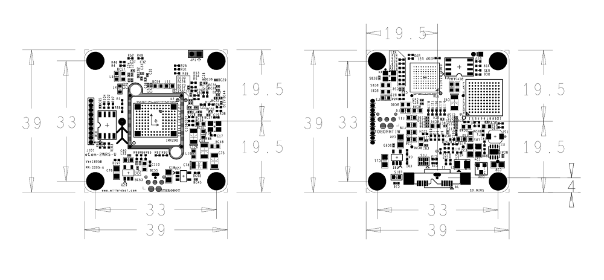

# oCam - 2MP USB 3.0 Color Wide Dynamic Range Camera
### Model No. oCam-2WRS-U - sales website

The oCam-2WRS-U is 2 mega pixel color camera with wide dynamic range (WDR) functionality to provide a superb image quality under various light conditions.
* Wide Dynamic Range (WDR)
* Full HD image resolution
* UVC compliant
* Changeable standard M12 lens

## Board Detail

## Specifications
Type | Description |
------|------|
**Sensor** | Sony IMX290 CMOS image sensor |
**Sensor Size** | 1/3 inch |
**Interface** | USB 3.0 Super-Speed |
**Lens** | Standard M12 Lens with focal length of 3.6mm | 
**Supported OS** | Windows 7/8/10, Linux, Plug-and play by UVC(USB Video Class) Protocol | 
**Power** | USB Bus Power | 
**Operation Temperature** | 0°C ~ + 70°C |
**Rating** | DC 5V/250mA |
**Shutter** | Rolling Shutter |
**Field Of View(FOV)** | 50˚(V) X 92.8˚(H) X 110˚(D) @ 1/2.9inch |
**Camera Control** | WDR On/Off | 
**Frame Rate** | 15fps, 30fps @1920x1080 | 
**Weight** | 27 gram approx.(Including protective case) | 
**PCB Size** | 39mm x 39mm(PCB) | 
**Case Size** | 49mm x 53mm x 20mm (Including Tripod Mount) |

## Softwares
* [oCam-2WRS-U_R1806](../../Firmware)
* [oCam_viewer_Windows](../../Software/oCam-viewer_Win)
* [oCam_viewer_Linux](../../Software/oCam_viewer_Linux)
