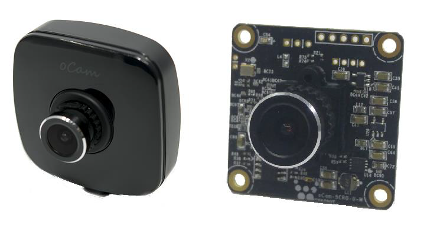
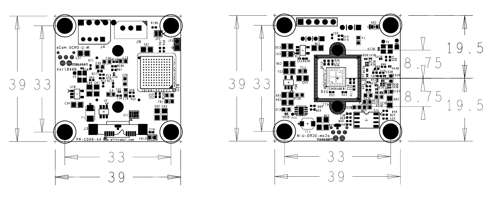
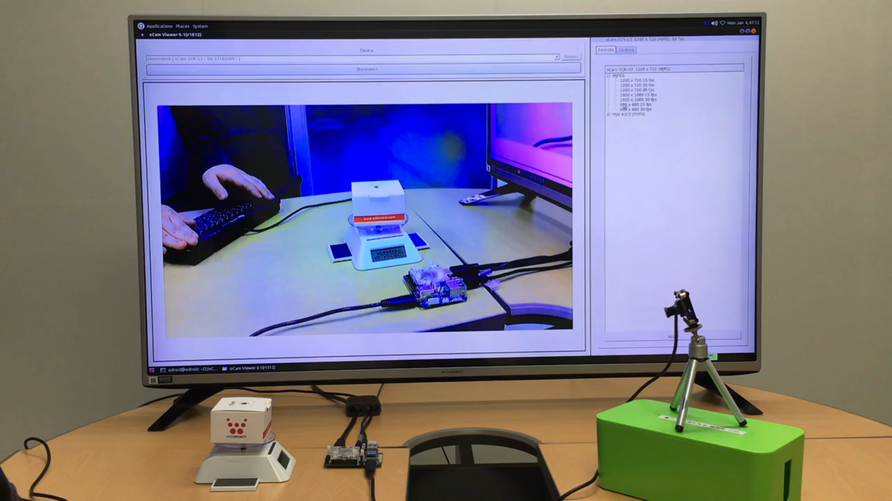
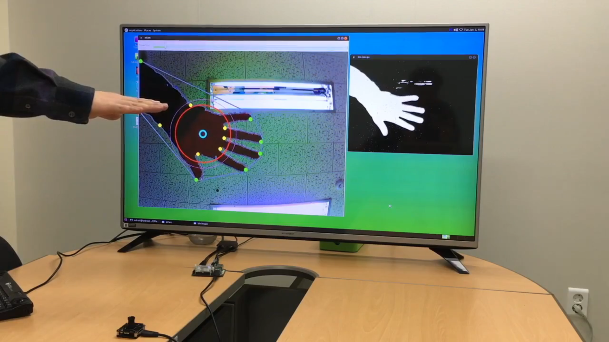
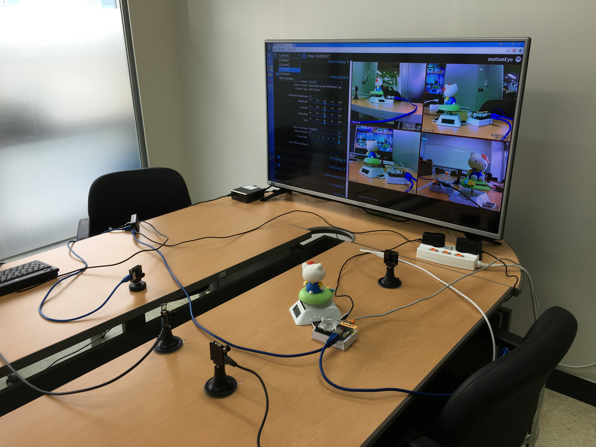
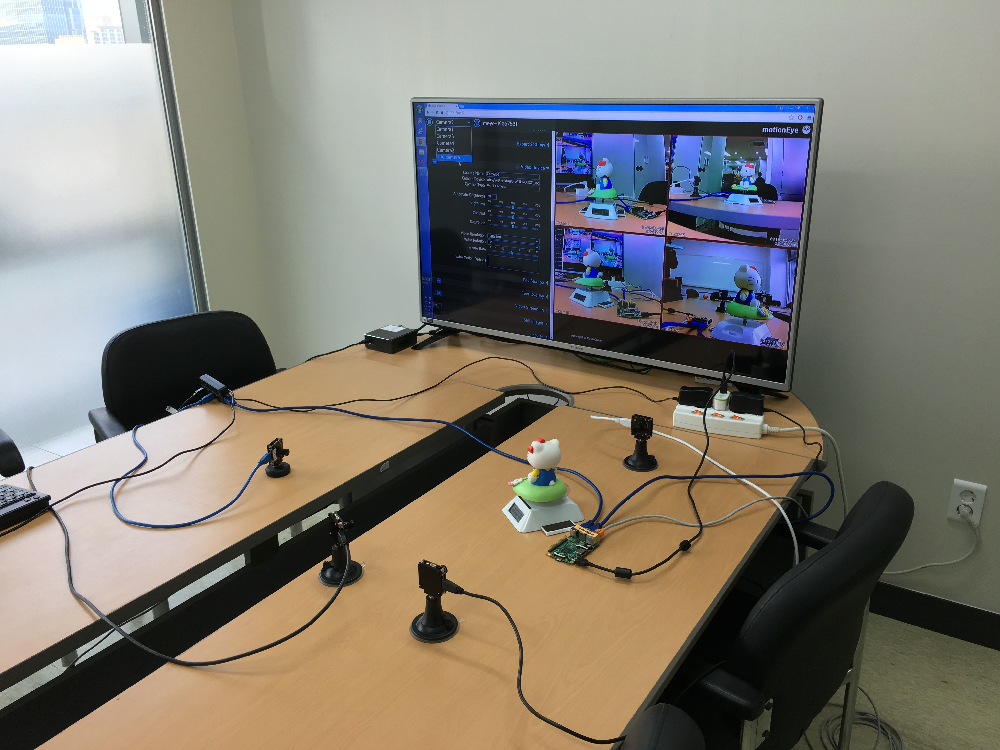

# oCam - 5MP USB 3.0 Color Camera
### Model No. oCam-5CRO-U-M - [sales website]

The oCam supports plug-and-play by UVC compliant adapting the standard M12 lens with focal length of 3.6mm. 
Direct memory access via USB 3.0 allows data to be written to main memory without going through the CPU. It reduces the CPU work load significantly.  
The newly released oCam-5CRO-U is an enhanced version of oCam-5CR-U3 with the following new features.
* Improved hardware stability with the single board design
* Plastic protective case is provided without any additional cost
* The USB connector is moved to back side for easier connection to host system. With the protective case this new vertical USB connector makes it easy to put the camera anywhere in a vertical orientation without any additional fixture or jig

## Board Detail

## Specifications
Type | Description |
------|------|
**Sensor** | OmniVision OV5640 CMOS Image sensor |
**Interface** | USB 3.0 Super-Speed |
**Lens** | Standard M12 Lens with focal length of 3.6mm | 
**Supported OS** | Windows7/8/10, Linux, Plug-and play by UVC(USB Video Class) protocol | 
**Power** | USB Bus Power | 
**Operation Temperature** | 0°C ~ + 70°C |
**Rating** | DC 5V/240mA |
**Shutter** | Electric Rolling Shutter |
**Field Of View(FOV)** | 65deg. |
**Camera Control** | Brightness, Contrast, Hue, Saturation, White Balance | 
**Frame Rate** | **YUV** 2592x1944@7\.5fps, 1920x1080@15fps, 1280x960@30fps, 1280x720@30fps, 640x480@120fps, 320x240@120fps etc.   **※ For further details, please refer the release note at [this page](../../Firmware)** | 
**Weight** | 33.5 gram approx.(Including protective case) | 
**PCB Size** | 39mm x 39mm | 
**Case Size** | 42mm x 42mm x 17mm |
**Depth** | 30-35 mm (Variable length for Manual Focusing) |

## oCam-Viewer (for Linux)

Detailed description is [here](../../Software/oCam_viewer_Linux).

## Application: HandGesture

Detailed description is [here](https://www.youtube.com/watch?v=th8hUD7Ajg4)

#### modifications
* Change color based hand segmentation method to background difference method
* Add a trackbar for the threshold value of difference image
* Add an exception process for the empty data frame
* Add an exception process for the no-palm detection
* Comment out saving result image
 
#### How to build
* Refer to the attached [Makefile](../../Examples/HandGesture/Makefile)

## MotionEye OS - Video surveillance system
* MotionEye OS(oCam + odroid XU4) 

* MotionEye OS(oCam + raspberryPi2) 

Detailed description is [here](https://github.com/ccrisan/motioneyeos)

