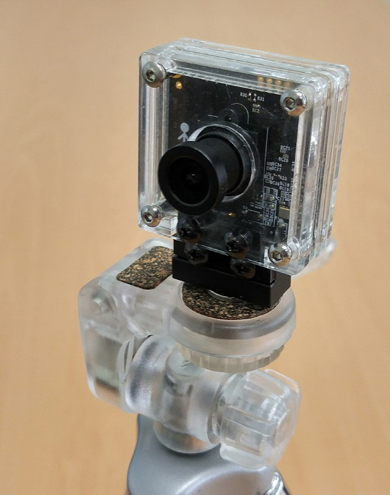
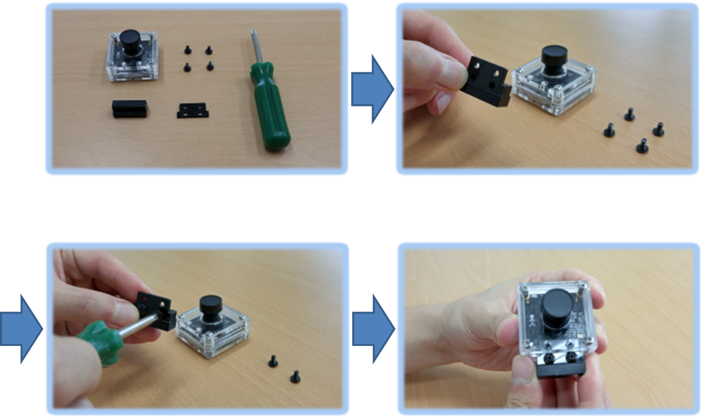
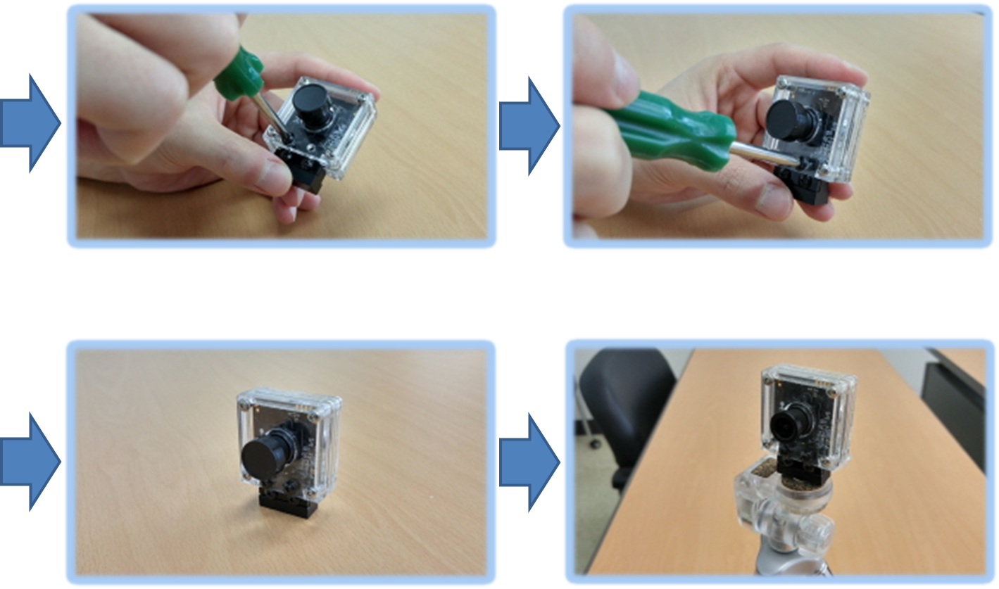

#oCam - Tripod Mount for oCam camera
###Model No. oCam-TM - sales website

## Features
* Supports oCam series cameras
* Verified compatibility with oCam camera
* Provides the standard hole size for camera tripods, 1/4”-20 UNC

## How to Assemble Tripod Mount for oCam

