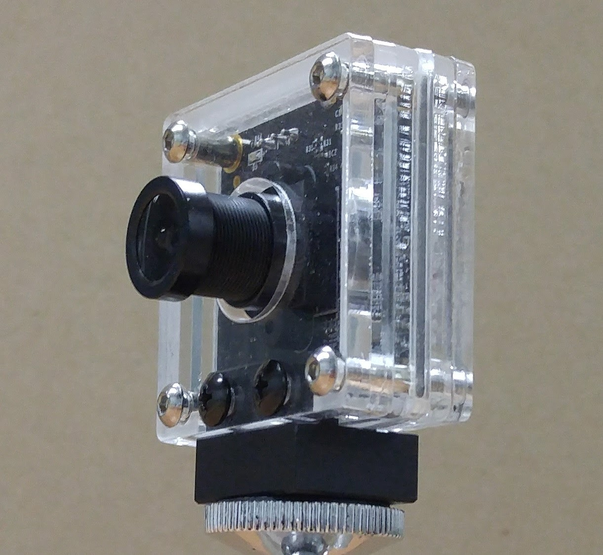
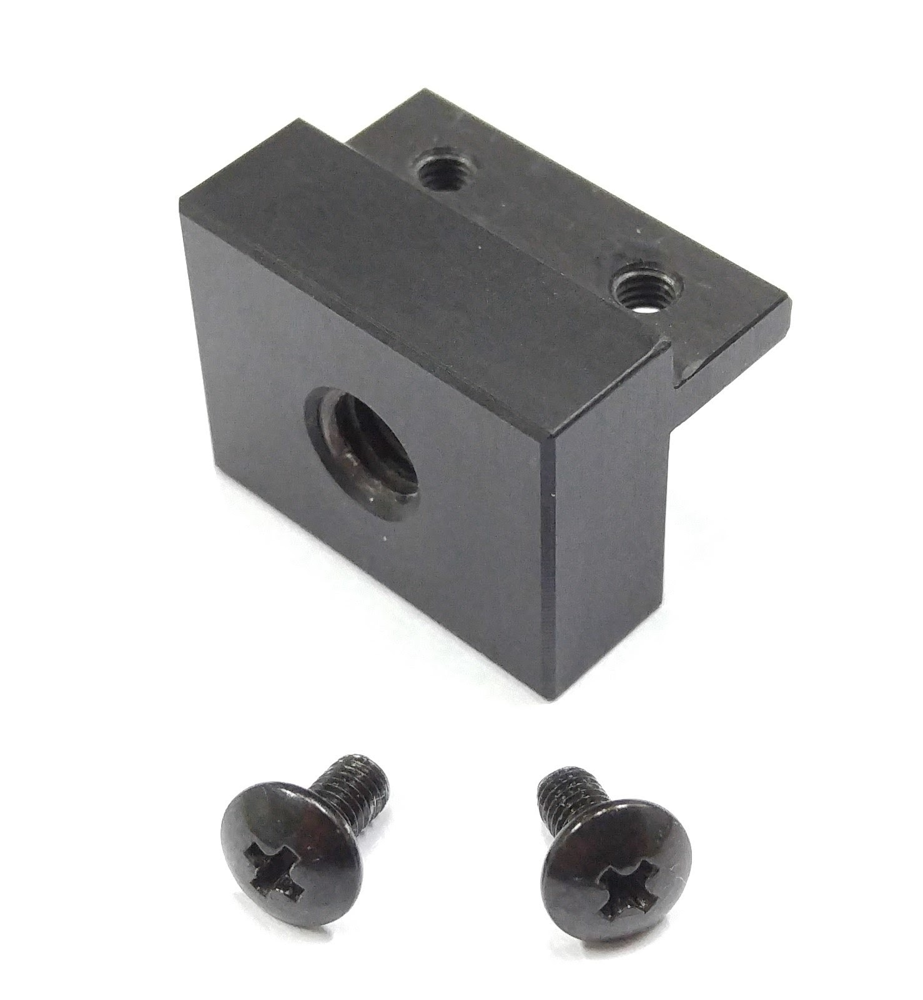

#oCam - Tripod Mount for oCam camera
###Model No. oCam-TM - [sales website](http://www.hardkernel.com/main/products/prdt_info.php?g_code=G147320796853)

## Features
* Supports oCam series cameras
* Verified compatibility with oCam camera
* Provides the standard hole size for camera tripods, 1/4”-20 UNC

