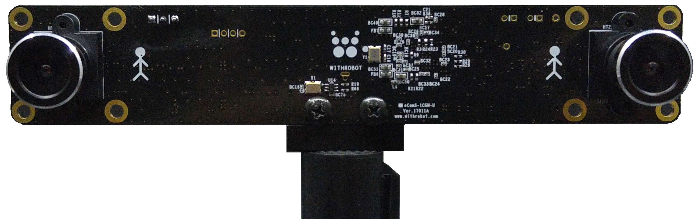
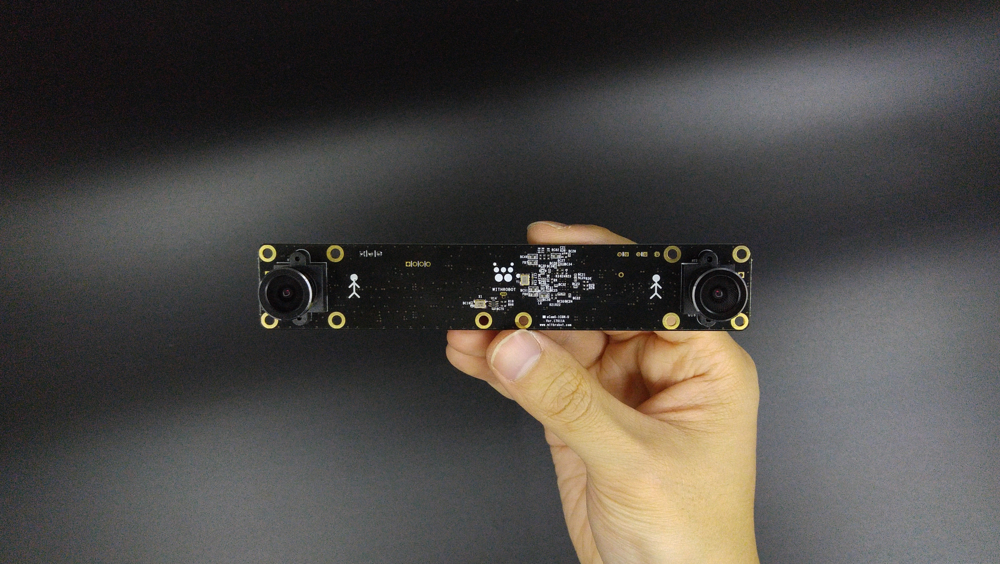

# oCamS-1CGN-U - USB 3.0 Stereo Camera - [(Korean)](Korean/README.md)
### Model No. oCamS-1CGN-U - sales website

## Features
*	ROS Compatibility: Provides compatibility with ROS (Robot Operating System) to utilize rich and powerful functionalities of ROS
*	Rich Data: Provides IMU data from the built-in sensors along with stereo images, which allows development of easy and useful applications
*	Versatile: Provides changeable standard M12 lens
*	Fast: Provides up to 2560x720 60fps images through USB 3.0 SuperSpeed interface
*	Cost Effective: Very affordable price among the cameras of similar grade

## Board Detail

## Specifications
Type | Description |
------|------|
**Sensor** | OnSemi AR0134 CMOS image sensor (1/3 inch) |
**Interface** | USB 3.0 Super-Speed |
**Lens** | Changeable standard M12 lens | 
**Supported OS** | Windows 7/8/10, Linux, Plug-and Play by UVC(USB Video Class) protocol | 
**Power** | USB Bus Power | 
**Operation Temperature** | 0°C ~ + 70°C |
**Rating** | DC 5V/240mA |
**Shutter** | Electric Global Shutter |
**Field Of View(FOV)** | - 65 degrees at full resolution of 1280(H) x 960(V)  - FOV for the following resolutions are reduced from the full resolution image due to cropping: 1280(H) x 720(V)  - FOV for the following resolutions is maintained due to binning: 640(H) x 480(V) |
**Baseline** | 120 mm | 
**Camera Control** | Brightness, Exposure, Color Gain(Red, Blue) | 
**Frame Rates** | 2560x960 @45fps, 2560x720 @60fps, 1280x480 @45fps | 
**Weight** | 30 gram approx. (including lens) | 
**Size** | 146mm x 26mm (PCB) | 

## Tutorials and Applications
* [oCamS-1CGN-U Tutorial - Update Firmware](https://github.com/withrobot/oCam/blob/master/Software/oCamS_ROS_Package/README.md#update-firmware)
* [oCamS-1CGN-U Tutorial - ROS & oCam ROS Package installation](https://github.com/withrobot/oCam/blob/master/Software/oCamS_ROS_Package/README.md#ros--ocam-ros-package-installation)
* [oCamS-1CGN-U Tutorial - Calibration](https://youtu.be/veahVVHA8H4)
* [Simultaneous Localization and Mapping(SLAM)](https://youtu.be/Zq3pChn_P1Y)
* [Obstacle Detection](https://youtu.be/Y5KV6uDU7QY)

## Softwares
* [oCamS_ROS_Package](../../Software/oCamS_ROS_Package)

## Firmware
* [oCamS-1CGN-U_R1707_170719.img](https://github.com/withrobot/oCam/blob/master/Firmware/oCamS-1CGN-U_R1707_170719.img)
