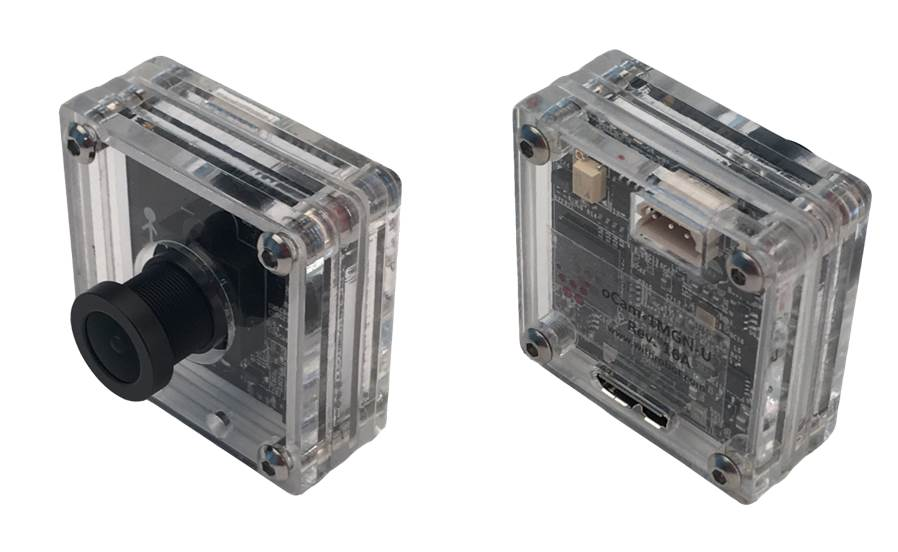
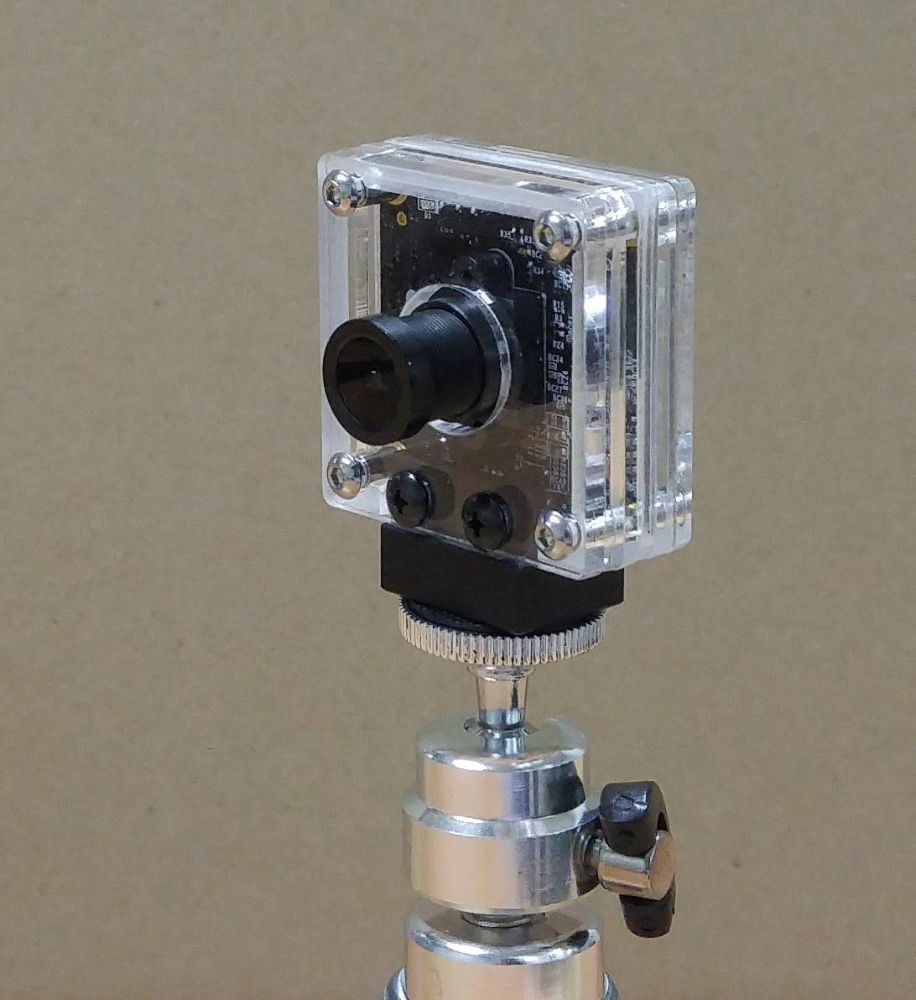

# [oCam-2WRS-U](Products/oCam-2WRS-U) (2MP USB 3.0 Color Wide Dynamic Range Camera)- [sales website]

# [oCam-1CGN-U](Products/oCam-1CGN-U) (1MP USB 3.0 Color Global Shutter Camera)- [sales website](http://www.hardkernel.com/main/products/prdt_info.php?g_code=G150091011568)

# [oCam-5CRO-U](Products/oCam-5CRO-U) (5MP USB 3.0 Color Camera) - [sales website](http://www.hardkernel.com/main/products/prdt_info.php?g_code=G145231889365)

# [oCam-1MGN-U](Products/oCam-1MGN-U) (1MP USB 3.0 Mono Global Shutter Camera)- [sales website](http://www.hardkernel.com/main/products/prdt_info.php?g_code=G147245683619)

# [oCam-TM](Products/oCam-TM) (Tripod Mount for oCam camera) - [sales website](http://www.hardkernel.com/main/products/prdt_info.php?g_code=G147320796853)

# [oCam Lens Set](Products/Lens4-8-6-3-2.6) (M12 Lens4) - [sales website](http://www.hardkernel.com/main/products/prdt_info.php?g_code=G147305973926)

