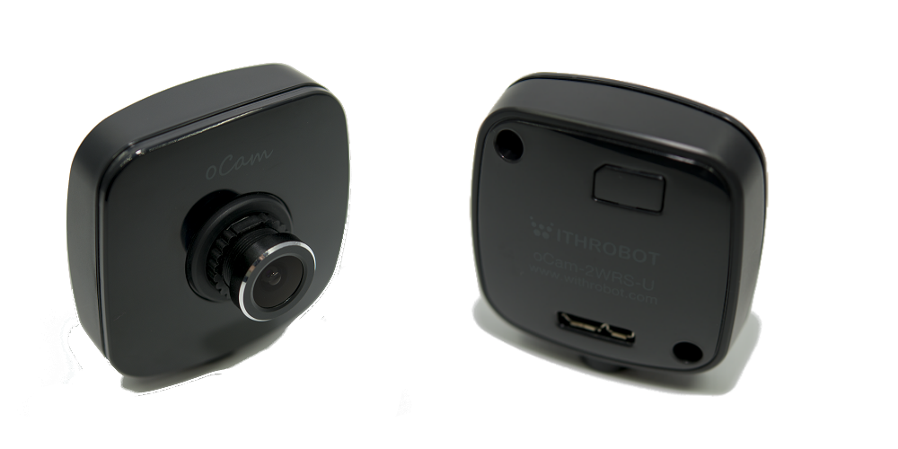
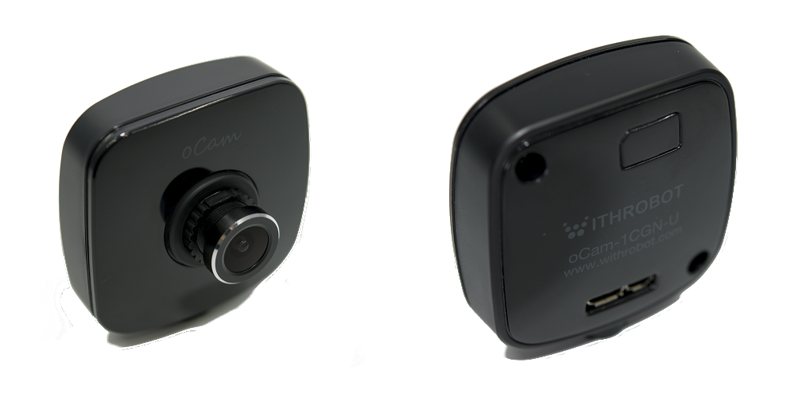
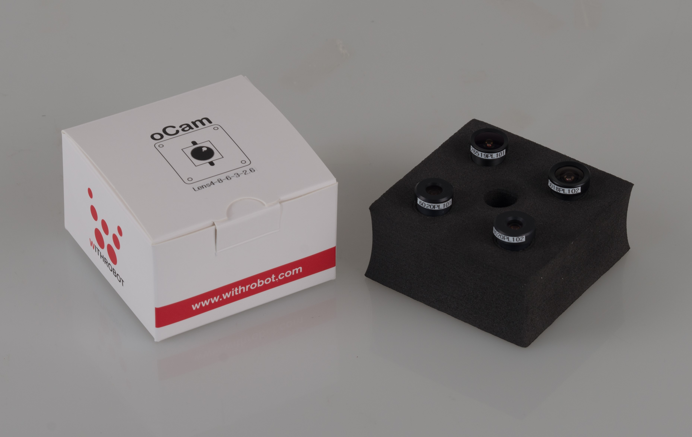

# [oCam-1CGN-U-T](Products/oCam-1CGN-U-T) (1MP USB 3.0 Color Trigger Global Shutter Camera) - [sales website](https://www.amazon.com/Global-Shutter-Camera-Trigger-oCam-1CGN-U-T/dp/B07RB4GYHZ/ref=sr_1_4?keywords=ocam-1&qid=1563261850&s=gateway&sr=8-4)
# [oCam-1MGN-U-T](Products/oCam-1MGN-U-T) (1MP USB 3.0 Mono Trigger Global Shutter Camera) - [sales website](https://www.amazon.com/Global-Shutter-Camera-Trigger-oCam-1MGN-U-T/dp/B07R7TBK5Z/ref=sr_1_5?keywords=ocam-1&qid=1563261788&s=gateway&sr=8-5)

# [oCam-2WRS-U](Products/oCam-2WRS-U) (2MP USB 3.0 Color Wide Dynamic Range Camera)- [sales website](https://www.amazon.com/IMX290-Color-Dynamic-Camera-oCam-2WRS-U/dp/B07RBNP7KY/ref=sr_1_1?keywords=ocam-2&qid=1563261903&s=gateway&sr=8-1)

# [oCam-1CGN-U](Products/oCam-1CGN-U) (1MP USB 3.0 Color Global Shutter Camera)- [sales website](https://www.hardkernel.com/shop/ocam-1cgn-u-plus-1mp-usb-3-0-color-global-shutter-camera/)

# [oCam-5CRO-U](Products/oCam-5CRO-U) (5MP USB 3.0 Color Camera) - [sales website](http://www.hardkernel.com/main/products/prdt_info.php?g_code=G145231889365)

# [oCam-1MGN-U](Products/oCam-1MGN-U) (1MP USB 3.0 Mono Global Shutter Camera)- [sales website](https://www.hardkernel.com/shop/ocam-1mgn-u-plus-1mp-usb3-0-mono-global-shutter/)

# [oCam-TM](Products/oCam-TM) (Tripod Mount for oCam camera) - [sales website](https://www.hardkernel.com/shop/tripod-mount-for-ocam-camera/)

# [oCam Lens Set](Products/Lens4-8-6-3-2.6) (M12 Lens4) - [sales website](https://www.hardkernel.com/shop/m12-lens-set-8-6-3-2-65mm-with-ir-cut-filter650/)

